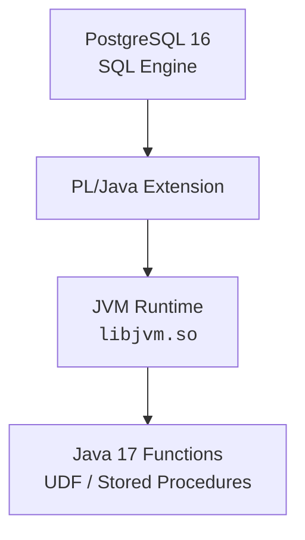

## **📋 Agenda**

1. 系統需求
2. 目錄結構
3. Docker 安裝流程
4. 初始化 SQL
5. 啟動與驗證
6. PL/Java 架構圖
7. 常見錯誤排查

---

# **🧱系統需求**

- PostgreSQL：**16**
- Java：**OpenJDK 17**
- PL/Java：**1.6.6 或以上**
- Docker / Docker Compose：最新版
- 作業系統：Mac（ARM需調整dockerfile） / Linux / Windows（Docker Desktop）

---

# **📁目錄結構**

```
pljava-pg16/
├── Dockerfile
├── docker-compose.yml
├── docker-entrypoint-initdb.d/
│   ├── init-pljava.sql          # PL/Java 初始化腳本
│   └── 01-test-pljava.sql       # PL/Java 測試腳本
├── pljava-1_6_10/               # PL/Java 源碼（編譯後產生）
├── V1_6_10.tar.gz              # PL/Java 源碼壓縮檔
└── README.md
```

---

# **🐳Docker 安裝流程**

## **➤Dockerfile**

```
# 使用 PostgreSQL 16 官方映像
FROM postgres:16-bullseye

# 安裝 OpenJDK 17 及編譯工具
RUN apt-get update && \
    apt-get install -y apt-utils openjdk-17-jdk maven gcc make libpq-dev wget postgresql-server-dev-16 libkrb5-dev && \
    rm -rf /var/lib/apt/lists/*

# 設定 JAVA_HOME
ENV JAVA_HOME=/usr/lib/jvm/java-17-openjdk-amd64
ENV PATH="${JAVA_HOME}/bin:${PATH}"

# 下載並編譯 PL/Java 1_6_6，並安裝到 PostgreSQL 16
RUN cd /tmp && \
    wget https://github.com/tada/pljava/archive/refs/tags/V1_6_10.tar.gz && \
    tar -xf V1_6_10.tar.gz --strip-components=1 && \
    mvn -DskipTests clean install && \
    cd pljava-packaging/target && \
    java -jar pljava-pg16.jar && \
    cd / && rm -rf /tmp/pljava-V1_6_10 /tmp/V1_6_10.tar.gz

# 複製初始化 SQL 腳本
COPY docker-entrypoint-initdb.d /docker-entrypoint-initdb.d
```

---

## **➤docker-compose.yml**

```
services:
  db:
    build: .
    image: postgres-pljava16-java17
    environment:
      POSTGRES_USER: devuser
      POSTGRES_PASSWORD: devpass
      POSTGRES_DB: devdb
    ports:
      - "5432:5432"
    volumes:
      - dbdata:/var/lib/postgresql/data

volumes:
  dbdata:
```

---

# **🧩初始化 SQL**

## **➤ init-pljava.sql**
```sql
ALTER SYSTEM SET pljava.libjvm_location = '/usr/lib/jvm/java-17-openjdk/lib/server/libjvm.so';
SELECT pg_reload_conf();

CREATE EXTENSION IF NOT EXISTS pljava;
GRANT USAGE ON LANGUAGE java TO PUBLIC;
```

## **➤ 01-test-pljava.sql**
```sql
-- 測試 PL/Java 擴展安裝
CREATE EXTENSION IF NOT EXISTS pljava;

-- 驗證 PL/Java 版本
SELECT sqlj.java_call_handler();
```

---

# **▶️啟動與驗證**

## **✓ Build**

```
docker compose build --no-cache db
```

## **✓ 啟動**

```
docker compose up -d
```

## **✓ 驗證**

### **檢查容器狀態**
```bash
docker compose ps
```

### **檢查擴展安裝**
```bash
docker exec -it <container_id> psql -U devuser -d devdb -c "\dx"
```

應看到：
```
pljava | 1.6.10 | Java procedural language
```

### **測試 Java 函數**
```bash
docker exec -it <container_id> psql -U devuser -d devdb -c "SELECT sqlj.java_call_handler();"
```

### **檢查 JVM 設定**
```bash
docker exec -it <container_id> psql -U devuser -d devdb -c "SHOW pljava.libjvm_location;"
```

---

# **🏗PL/Java Runtime Flow**

以下提供 **兩種 Notion 支援格式**：

---

# **A. ASCII 架構圖**

# **（適合 Notion 文字段落）**

```
         ┌──────────────────────────┐
         │        PostgreSQL        │
         │      (SQL Engine)        │
         └──────────────┬───────────┘
                        │
                        │  CALL
                        ▼
              ┌──────────────────┐
              │   PL/Java Layer  │
              │  (Language Ext)  │
              └───────┬──────────┘
                      │
      ┌───────────────┴────────────────┐
      │     JVM Embedded in PG Process │
      │   libjvm.so / Java 17 Runtime  │
      └───────────────┬────────────────┘
                      │
                      ▼
           ┌───────────────────────┐
           │   Java Functions      │
           │  (UDF / Stored Proc)  │
           └───────────────────────┘
```

---

# **B. Mermaid Diagram**

# **（Notion 可自動渲染）**

```

```

---

# **☕ Java 函數範例**

## **➤ 簡單 Hello World 函數**

### **1. 建立 Java 類別**
```java
public class HelloWorld {
    public static String sayHello(String name) {
        return "Hello, " + name + "!";
    }
    
    public static int addNumbers(int a, int b) {
        return a + b;
    }
}
```

### **2. 編譯並載入**
```sql
-- 載入 JAR 檔案
SELECT sqlj.install_jar('file:///path/to/HelloWorld.jar', 'hello', true);

-- 建立函數
CREATE OR REPLACE FUNCTION say_hello(name TEXT)
RETURNS TEXT
AS 'HelloWorld.sayHello'
LANGUAGE java;

CREATE OR REPLACE FUNCTION add_numbers(a INTEGER, b INTEGER)
RETURNS INTEGER
AS 'HelloWorld.addNumbers'
LANGUAGE java;
```

### **3. 測試函數**
```sql
SELECT say_hello('PL/Java');
-- 結果: Hello, PL/Java!

SELECT add_numbers(10, 20);
-- 結果: 30
```

---

## **➤ 資料庫操作範例**

```java
import java.sql.*;
import org.postgresql.pljava.annotation.Function;

public class DatabaseExample {
    
    @Function
    public static int countUsers() throws SQLException {
        Connection conn = DriverManager.getConnection("jdbc:default:connection");
        PreparedStatement stmt = conn.prepareStatement("SELECT COUNT(*) FROM users");
        ResultSet rs = stmt.executeQuery();
        
        if (rs.next()) {
            return rs.getInt(1);
        }
        return 0;
    }
    
    @Function
    public static String getUserEmail(int userId) throws SQLException {
        Connection conn = DriverManager.getConnection("jdbc:default:connection");
        PreparedStatement stmt = conn.prepareStatement(
            "SELECT email FROM users WHERE id = ?"
        );
        stmt.setInt(1, userId);
        ResultSet rs = stmt.executeQuery();
        
        if (rs.next()) {
            return rs.getString("email");
        }
        return null;
    }
}
```

---

## **➤ 觸發器範例**

```java
import org.postgresql.pljava.annotation.Trigger;
import org.postgresql.pljava.TriggerData;
import java.sql.SQLException;

public class AuditTrigger {
    
    @Trigger
    public static void auditChanges() throws SQLException {
        TriggerData td = TriggerData.getCurrentTriggerData();
        
        // 記錄變更到審計表
        Connection conn = DriverManager.getConnection("jdbc:default:connection");
        PreparedStatement stmt = conn.prepareStatement(
            "INSERT INTO audit_log (table_name, operation, changed_at) VALUES (?, ?, NOW())"
        );
        
        stmt.setString(1, td.getTableName());
        stmt.setString(2, td.getEvent().toString());
        stmt.executeUpdate();
    }
}
```

---

# **🧯常見錯誤排查**

## **1. no configuration file provided: not found**

- 多半是 docker-compose.yml 檔名後面有空白
- 修正：

```bash
mv "docker-compose.yml " docker-compose.yml
```

---

## **2. COPY pljava-pg16.jar not found**

- 先前版本 Dockerfile 需要 jar，但你沒有
- ✔ 已改為「自動下載 + 編譯」

---

## **3. Postgres 找不到 libjvm.so**

**檢查 JVM 路徑：**
```bash
docker exec -it <container_id> find /usr/lib/jvm -name libjvm.so
```

**修正設定：**
```sql
ALTER SYSTEM SET pljava.libjvm_location = '<實際路徑>';
SELECT pg_reload_conf();
```

---

## **4. Extension 沒出現在 \dx**

- Build 時 PL/Java 未成功安裝
- 請查看 build log 是否有 Maven 或 compiler 錯誤

**檢查編譯日誌：**
```bash
docker compose build --no-cache db 2>&1 | grep -i error
```

---

## **5. 容器啟動失敗**

**檢查容器日誌：**
```bash
docker compose logs db
```

**常見原因：**
- 端口 5432 被占用
- 磁碟空間不足
- Docker 記憶體不足

---

## **6. ARM Mac 相容性問題**

**修改 Dockerfile 第一行：**
```dockerfile
# ARM Mac 使用
FROM --platform=linux/amd64 postgres:16-bullseye

# 或使用 ARM 原生版本
FROM postgres:16-bullseye
```

**設定 JAVA_HOME（ARM）：**
```dockerfile
ENV JAVA_HOME=/usr/lib/jvm/java-17-openjdk-arm64
```

---

# **🔧 實用指令**

## **➤ 容器管理**
```bash
# 重建並啟動
docker compose up --build -d

# 停止並清理
docker compose down -v

# 進入容器
docker exec -it <container_id> bash

# 連接資料庫
docker exec -it <container_id> psql -U devuser -d devdb
```

## **➤ 日誌查看**
```bash
# 即時日誌
docker compose logs -f db

# PostgreSQL 日誌
docker exec -it <container_id> tail -f /var/log/postgresql/postgresql-16-main.log
```

## **➤ 效能監控**
```bash
# 容器資源使用
docker stats <container_id>

# 資料庫連線數
docker exec -it <container_id> psql -U devuser -d devdb -c "SELECT count(*) FROM pg_stat_activity;"
```

---
# **📚 參考資源**

## **➤ 官方文件**
- [PL/Java GitHub](https://github.com/tada/pljava)
- [PL/Java 官方文件](https://tada.github.io/pljava/)
- [PostgreSQL 官方文件](https://www.postgresql.org/docs/16/)

## **➤ Docker 相關**
- [PostgreSQL Docker Hub](https://hub.docker.com/_/postgres)
- [Docker Compose 文件](https://docs.docker.com/compose/)

## **➤ Java 開發**
- [OpenJDK 17 文件](https://openjdk.org/projects/jdk/17/)
- [JDBC 教學](https://docs.oracle.com/javase/tutorial/jdbc/)

---

# **📝 版本記錄**

| 版本 | 日期 | 更新內容 |
|------|------|----------|
| 1.0.0 | 2024-01 | 初始版本，支援 PostgreSQL 16 + PL/Java 1.6.10 |
| 1.0.1 | 2024-01 | 新增 Java 函數範例和實用指令 |

---

# **⚙️ 環境資訊**

- **PostgreSQL**: 16.x
- **PL/Java**: 1.6.10
- **Java**: OpenJDK 17
- **Docker**: 20.10+
- **Docker Compose**: 2.0+
- **作業系統**: macOS / Linux / Windows

---

**🚀 快速開始：**
```bash
git clone <your-repo>
cd pljava-pg16
docker compose up --build -d
```

**❓ 問題回報：** 請在 GitHub Issues 中提出